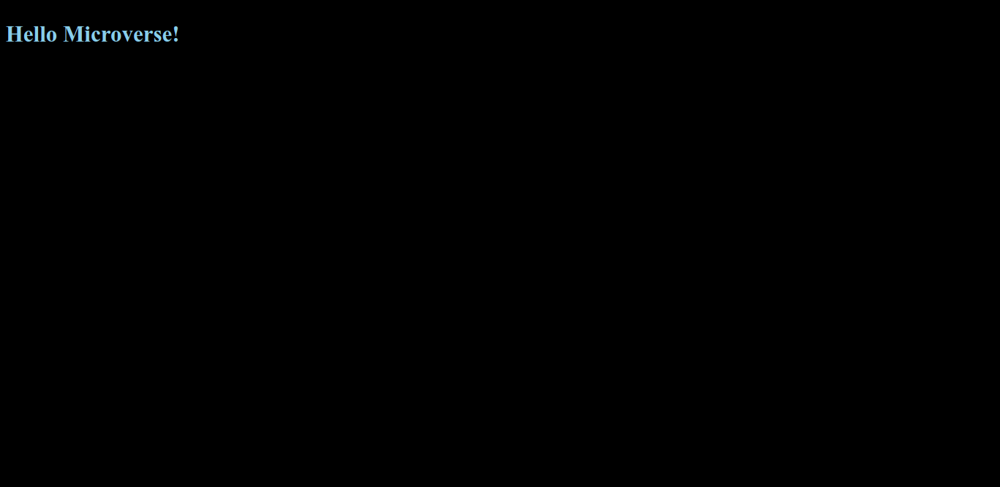

# Hello Microverse

> An sample project for setting linters.

In this project, I set up a html-css linter and lighthouse.

## Built With

- HTML/CSS
- Markdown
- Git, Github

## Live Demo

[Hello Microverse](https://jssol.github.io/hello-world)

## Authors

👤 **Jonathan Sivahera**

- GitHub: [@jssol](https://github.com/jssol)
- Twitter: [@jsivahera](https://twitter.com/jsivahera)
- LinkedIn: [Jonathan Sivahera](https://linkedin.com/in/jsivahera)

## 🤝 Contributing

Contributions, issues, and feature requests are welcome!

Feel free to check the [issues page](../../issues/).

## Show your support

Give a ⭐️ if you like this project!

## 📝 License

This project is [MIT](./MIT.md) licensed.
